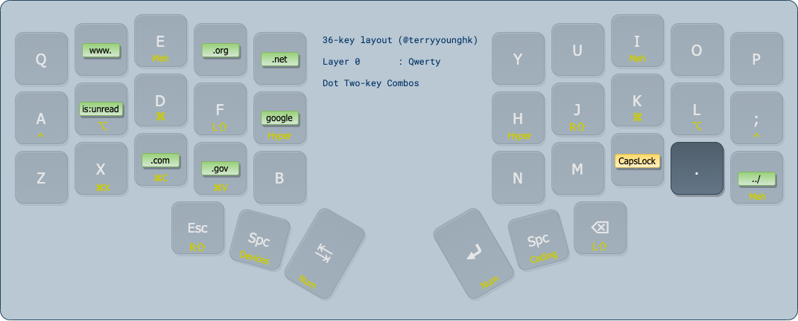
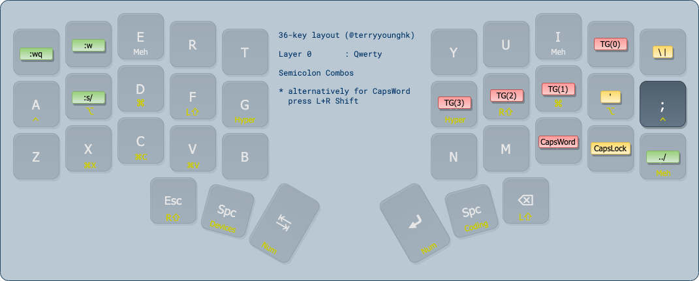
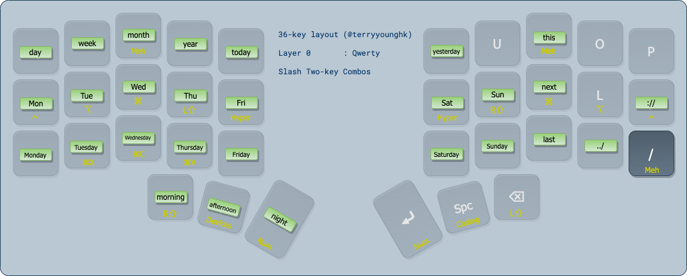

# Personal QMK userspace

This is a personal userspace repo for QMK keyboard firmware.

# Layout

| Characteristics | Support | Notes |
--------------|:-----:|---
Keys | 36 |/
Layers | 4 |/
Base Layer | QWERTY |/
Home Row Mods | Yes | Plus Hyper & Meh keys
Tap Dance | Yes |/
Combos | Yes |/
One Shot Keys | No |/
Caps Word Toggle | Yes | Hold L+R Shift keys
Momentary Layer Switching | Yes | Thumb clusters
Toggle Layer Switching | Yes | Combo

## Layers

### Base Layer


### Number Layer


### Coding Layer


### Controls Layer


## Combos

Below only highlights some of the **two-key** combos:
1. Adjacent keys (horizontally and vertically)
2. A specific key plus another key

There are more combos in `combos.def`, including words and phrases I personally use the most.

### Adjacent Key Combos


### Dot Combos



### Semicolon Combos



### Slash Combos



# Building

```
qmk compile ./keymaps/sol3.json
```
# Flashing

```
qmk flash ./keymaps/sol3.json
```

# Useful References

## Userspaces

- [Standalone Userspace by filterpaper](https://filterpaper.github.io/qmk/userspace.html)
- [QMK Cheatsheet](https://jayliu50.github.io/qmk-cheatsheet/)

## Combos

When defining combos that involve multi-role keys, use the full name of the dual-role key or its tap keycode.

This is a common error.

```
const uint16_t PROGMEM A_S_COMBO[] = {KC_A, KC_S, COMBO_END}; // ❎ Incorrect
const uint16_t PROGMEM A_S_COMBO[] = {LGUI_T(KC_A), LALT_T(KC_S), COMBO_END}; // ✅ Correct
```

- https://docs.qmk.fm/#/feature_combo?id=combos
- http://combos.gboards.ca/
- https://precondition.github.io/home-row-mods#using-mod-taps-in-combos

# TODO

1. github action workflow
2. leader keys (maybe)
3. layer state audio feedback (if supported)
4. test oled (previously untested)