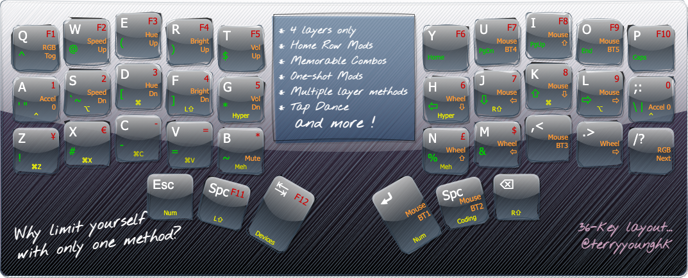
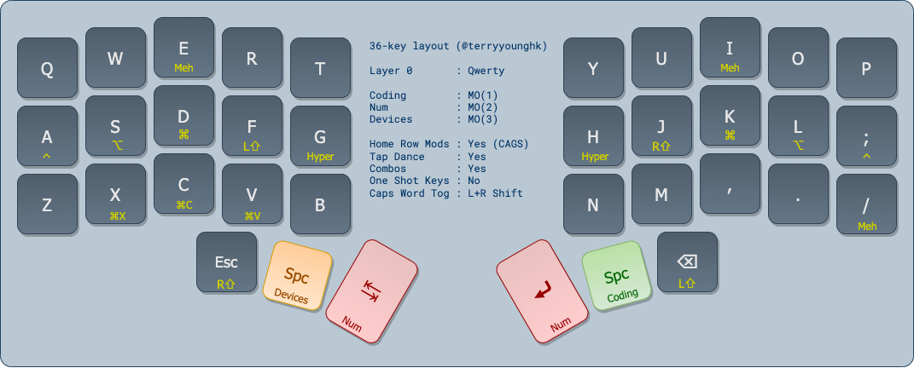
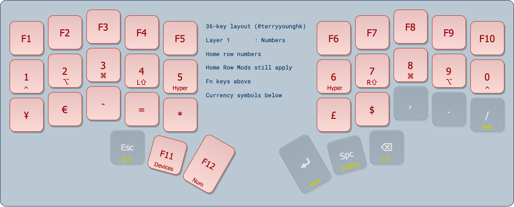
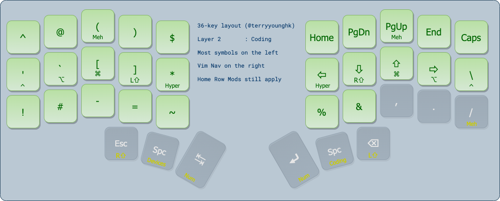
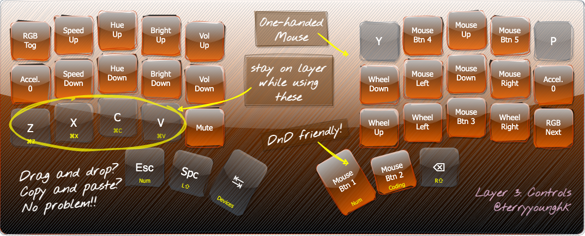
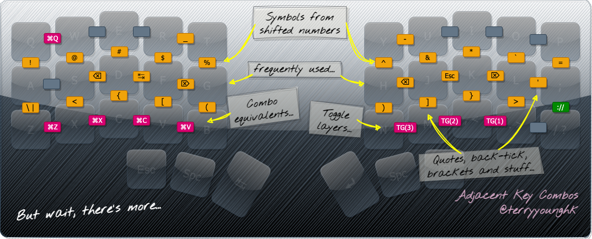
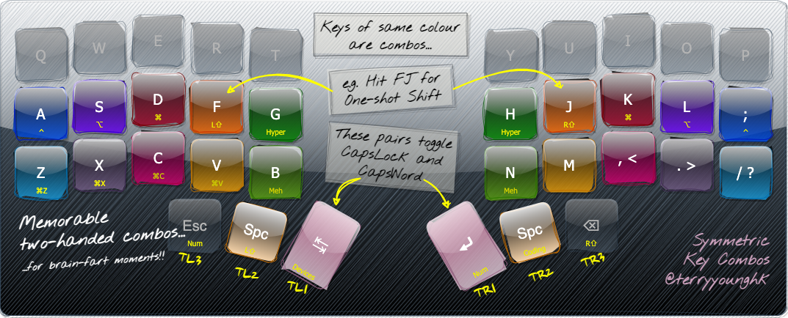
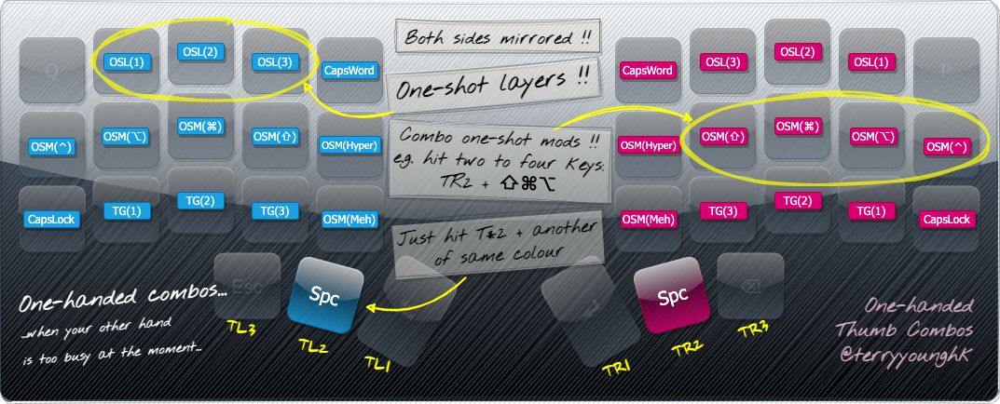
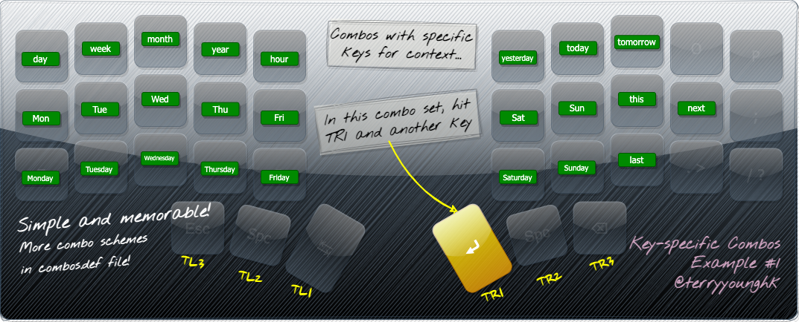
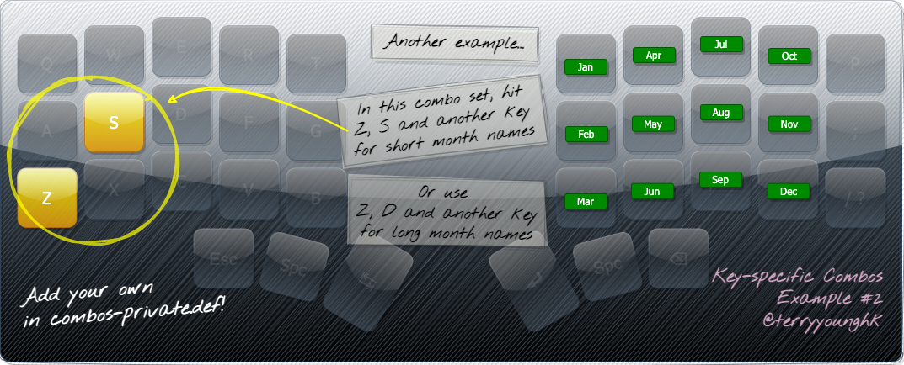

# Personal QMK userspace

This is a personal userspace repo for QMK keyboard firmware.

Disclaimer: this is only tested on RGBKB sol3, which is the keyboard I currently use.



# Characteristics

While being a 36-key layout, it is also 34-key friendly throughout all layers and combos.

This firmware features home row mods and multiple ways to access your layers and modifier keys in one-handed or two-handed situations.

It also demonstrates various ways to implement memorable key combo layouts that you can build upon.

| Characteristics | Support | Notes |
--------------|:-----:|---
Keys | 36 |/
Layers | 4 |/
Base Layer | ALPHAS |/
Home Row Mods | Yes | On all layers
Tap Dance | Yes |/
Combos | Yes |/
Caps Word | Yes | Using Comboes, or hold L+R Shift
One Shot Modifiers | Yes | Using Combos
One Shot Layers | Yes | Using Combos
Toggle Layer | Yes | Using Combos
Momentary Layers | Yes | Using Thumb Clusters

# Layers

## Base Layer



## Number Layer



## Coding Layer



## Controls Layer



While this Controls layer gives you mouse, keyboard RGB and volume controls, operations like `Undo` and `Clipboard` remains accessible with either tap dances or key combos, which can be good for things such as quick edits on draw.io.

# Combos

This firmware features several combo schemes for various purposes, as illustrated in the images below.

One-shot modifiers are provided in both one-handed or two-handed combos. (particularly good for left-handed operations while the right hand is on a mouse/trackpad)

In addition, there are more combos in `combos.def`, including words and phrases I personally use the most.

## Adjacent Key Combos



This combo scheme mainly features the following:

1. special characters on columns matching shifted num keys on traditional keyboards
2. common special keys on home row
3. common clipboard/undo/quit shortcuts
4. layer toggling

## Symmetric Key Combos



This combo scheme provides one-shot modifiers that match the positions of home row mods, plus other common keyboard shortcuts as well.

Examples:
| Combo | Output
| ------|:---
| `A;` | `OSM(⌃)`
| `SL` | `OSM(⌥)`
| ... | ...
| `Z/` | `⌘Z`
| `X.` | `⌘X`
| ... | ...
| `BN` | `OSM(Meh)`
| `TL1 + TR1` | `Caps Lock`
| `TL2 + TR2` | `Caps Word`

One-shot mods can be chained too. For example, to perform `Cmd+Shift+S`, you can hit `DK`, then hit `FJ`, then `S`.

## One-handed Combos



This combo scheme provides one-shot modifiers, one-shot layers, toggle layers and Caps Lock/Word, all via one-handed combos on either side.

The two sides are mirrored.

One-shot modifiers can be chained, and multi-modifiers can be done in one or more shots.

For example, the following all produce the same result:

| Hit Sequence | Result | Notes
| ------|:---|---
| `TR2 + J + K + L`<br>`S` | `Cmd + Alt + Shift + S` | Hit four keys, then S
| `TR2 + J`<br>`TR2 + K`<br>`TR2 + L`<br>`S` | `Cmd + Alt + Shift + S` | Chain each modifier individual, but more hits
| `TR2 + J + K`<br>`TR2 + L`<br>`S` | `Cmd + Alt + Shift + S` | Another way to chain modifiers
| `TR2 + J + K`<br>`TR2 + J + L`<br>`S` | `Cmd + Alt + Shift + S` | Repeated mods are not cancelled, they are added

 So for example, to execute `Cmd + Shift + S` with the left hand only, hit `Spc + D`, `Spc + S` then `S` in succession.

## Key-specific Combos



This type of combo scheme consists of one specific key representing a particular context, plus any other key.

For example, screenshot shows combos in the context of weekdays and date related words, executed by hitting `TR1` (Right Thumb, second key) plus another key.

And for example, `TR1 + D` outputs the string `Wed`.

## More combos

Another example below shows the `ZS` combos which output short month names. Similarly, `ZD` combos output long month names.



There are more combos in `combos.def`, including those that output words and phrases I frequently use but too lazy to type over and over again...

## Private Combos

You can also start extending your own preferences/overides in `combos-private.def`.

It contain combos that, for example, output command strings or work-related terminologies, etc.

Before adding your own, to prevent Git from committing changes to all `combos-private*.def` files, run the following:

```
git update-index --assume-unchanged ./combos/combos-private.def
```

# Setup

Read the friendly manual from [docs.qmk.fm](https://docs.qmk.fm/) and follow their setup.

Next, assuming you are already in the `qmk_firmware` directory, grab this firmware source as follows:

```
git clone https://github.com/terryyounghk/qmk_userspace.git users/terryyounghk
```

# Compiling

Assuming you are already in the `qmk_firmware/users/terryyounghk` directory:

```
qmk compile ./keymaps/sol3.json
```

Note: This firmware uses `CW_TOGG` in [Caps Word](https://docs.qmk.fm/#/feature_caps_word), which was renamed from the previous `CAPSWRD` since 2022-11-26. Please [update your QMK set up](https://docs.qmk.fm/#/newbs_git_using_your_master_branch?id=updating-your-master-branch) to pick up this change.

# Flashing

Assuming you are already in the `qmk_firmware/users/terryyounghk` directory:

```
qmk flash ./keymaps/sol3.json
```

# Useful References

## Userspaces

- [Standalone Userspace by filterpaper](https://filterpaper.github.io/qmk/userspace.html)
- [QMK Cheatsheet](https://jayliu50.github.io/qmk-cheatsheet/)

## Combos

When defining combos that involve multi-role keys, use the full name of the dual-role key or its tap keycode.

This is a common error.

```
const uint16_t PROGMEM A_S_COMBO[] = {KC_A, KC_S, COMBO_END}; // ❎ Incorrect
const uint16_t PROGMEM A_S_COMBO[] = {LGUI_T(KC_A), LALT_T(KC_S), COMBO_END}; // ✅ Correct
```

- https://docs.qmk.fm/#/feature_combo?id=combos
- http://combos.gboards.ca/
- https://precondition.github.io/home-row-mods#using-mod-taps-in-combos

Caps Word

- https://kbd.news/Caps-Word-and-other-QMK-tips-1073.html
- https://getreuer.info/posts/keyboards/caps-word/index.html#add-caps-word-to-your-keymap

# TODO

- audio feedback of layer state and other states (if supported)
- dynamic macros
- github action workflow

<!--
- leader keys (maybe)
- test OLED (previously untested)
- Option to compile with Colemak-DH (low priority, I don't use it)
-->