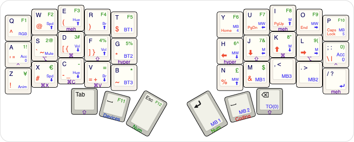

# Personal QMK userspace

This is a personal userspace repo for QMK keyboard firmware.

(work in progress)

# Layout

http://www.keyboard-layout-editor.com/#/gists/ea73aa52bfccbce962bf61f8126d1fdb



Similar layout implementations:
- Moonlander: https://configure.zsa.io/moonlander/layouts/vmZmb
# Building

```
qmk compile ./keymaps/sol3.json
```
# Flashing

```
qmk flash ./keymaps/sol3.json
```

# Useful References

## Userspaces

- [Standalone Userspace by filterpaper](https://filterpaper.github.io/qmk/userspace.html)
- [QMK Cheatsheet](https://jayliu50.github.io/qmk-cheatsheet/)

## Combos

When defining combos that involve dual-role keys,
make sure to use the full name of the dual-role key,
not just its tap keycode.

This is a common error.

```
const uint16_t PROGMEM A_S_COMBO[] = {KC_A, KC_S, COMBO_END}; // ❎ Incorrect
const uint16_t PROGMEM A_S_COMBO[] = {LGUI_T(KC_A), LALT_T(KC_S), COMBO_END}; // ✅ Correct
```

- https://docs.qmk.fm/#/feature_combo?id=combos
- http://combos.gboards.ca/
- https://precondition.github.io/home-row-mods#using-mod-taps-in-combos

# TODO

1. wip: finalize combos
2. leader keys
